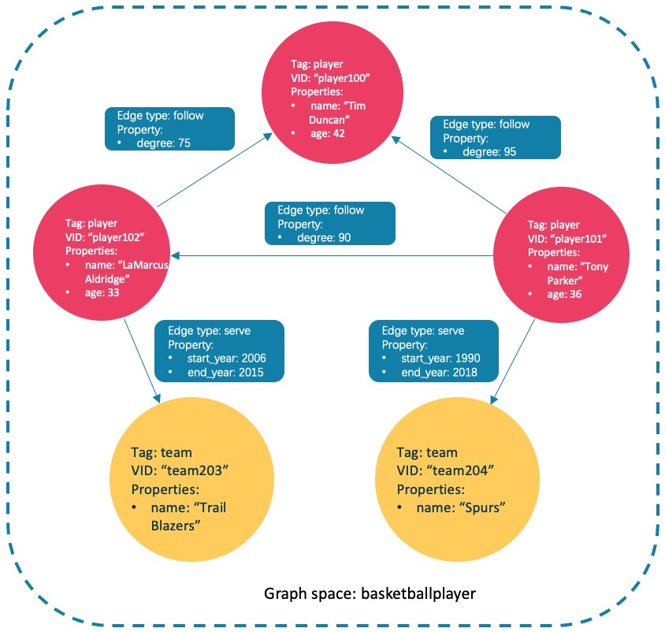
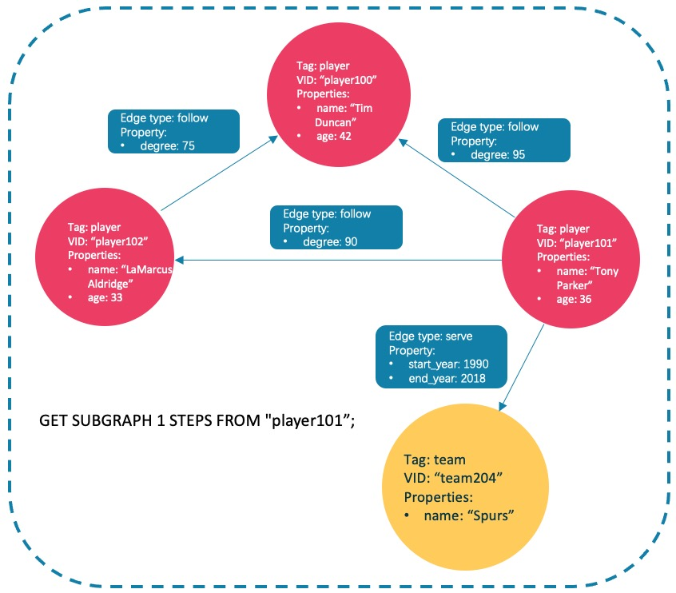
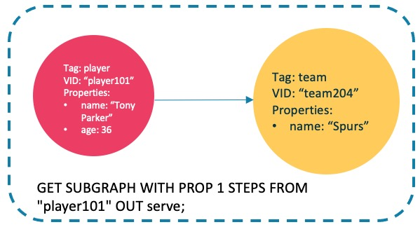

# GET SUBGRAPH

`GET SUBGRAPH`语句检索指定Edge type的起始点可以到达的点和边的信息，返回子图信息。

## 语法

```ngql
GET SUBGRAPH [WITH PROP] [<step_count> STEPS] FROM {<vid>, <vid>...}
[{IN | OUT | BOTH} <edge_type>, <edge_type>...]
[YIELD [VERTICES AS <vertex_alias>] [,EDGES AS <edge_alias>]];
```

- `WITH PROP`：展示属性。不添加本参数则隐藏属性。

- `step_count`：指定从起始点开始的跳数，返回从0到`step_count`跳的子图。必须是非负整数。默认值为1。

- `vid`：指定起始点ID。

- `edge_type`：指定Edge type。可以用`IN`、`OUT`和`BOTH`来指定起始点上该Edge type的方向。默认为`BOTH`。

- `YIELD`：定义需要返回的输出。可以仅返回点或边。必须设置别名。不使用`YIELD`定义输出结果时，默认返回`_vertices`和`_edges`。

!!! note

    `GET SUBGRAPH`语句检索的路径类型为`trail`，即检索的路径只有点可以重复，边不可以重复。详情请参见[路径](../../1.introduction/2.1.path.md)。

## 示例

以下面的示例图进行演示。



插入测试数据：

```ngql
nebula> CREATE SPACE subgraph(partition_num=15, replica_factor=1, vid_type=fixed_string(30));
nebula> USE subgraph;
nebula> CREATE TAG player(name string, age int);
nebula> CREATE TAG team(name string);
nebula> CREATE EDGE follow(degree int);
nebula> CREATE EDGE serve(start_year int, end_year int);
nebula> INSERT VERTEX player(name, age) VALUES "player100":("Tim Duncan", 42);
nebula> INSERT VERTEX player(name, age) VALUES "player101":("Tony Parker", 36);
nebula> INSERT VERTEX player(name, age) VALUES "player102":("LaMarcus Aldridge", 33);
nebula> INSERT VERTEX team(name) VALUES "team203":("Trail Blazers"), "team204":("Spurs");
nebula> INSERT EDGE follow(degree) VALUES "player101" -> "player100":(95);
nebula> INSERT EDGE follow(degree) VALUES "player101" -> "player102":(90);
nebula> INSERT EDGE follow(degree) VALUES "player102" -> "player100":(75);
nebula> INSERT EDGE serve(start_year, end_year) VALUES "player101" -> "team204":(1999, 2018),"player102" -> "team203":(2006,  2015);
```

- 查询从点`player101`开始、0~1跳、所有Edge type的子图。

    ```ngql
    nebula> GET SUBGRAPH 1 STEPS FROM "player101" YIELD VERTICES AS nodes, EDGES AS relationships;
    +-------------------------------------------------------------------------+-----------------------------------------------------------------------------------------------------------------------------+
    | nodes                                                                   | relationships                                                                                                               |
    +-------------------------------------------------------------------------+-----------------------------------------------------------------------------------------------------------------------------+
    | [("player101" :player{})]                                               | [[:serve "player101"->"team204" @0 {}], [:follow "player101"->"player100" @0 {}], [:follow "player101"->"player102" @0 {}]] |
    | [("team204" :team{}), ("player100" :player{}), ("player102" :player{})] | [[:follow "player102"->"player100" @0 {}]]                                                                                  |
    +-------------------------------------------------------------------------+-----------------------------------------------------------------------------------------------------------------------------+
    ```

    返回的子图如下。

    

- 查询从点`player101`开始、0~1跳、`follow`类型的入边的子图。

    ```ngql
    nebula> GET SUBGRAPH 1 STEPS FROM "player101" IN follow YIELD VERTICES AS nodes, EDGES AS relationships;
    +---------------------------+---------------+
    | nodes                     | relationships |
    +---------------------------+---------------+
    | [("player101" :player{})] | []            |
    | []                        | []            |
    +---------------------------+---------------+
    ```

    因为`player101`没有`follow`类型的入边。所以仅返回点`player101`。

- 查询从点`player101`开始、0~1跳、`serve`类型的出边的子图，同时展示边的属性。

    ```ngql
    nebula> GET SUBGRAPH WITH PROP 1 STEPS FROM "player101" OUT serve YIELD VERTICES AS nodes, EDGES AS relationships;
    +-------------------------------------------------------+-------------------------------------------------------------------------+
    | nodes                                                 | relationships                                                           |
    +-------------------------------------------------------+-------------------------------------------------------------------------+
    | [("player101" :player{age: 36, name: "Tony Parker"})] | [[:serve "player101"->"team204" @0 {end_year: 2018, start_year: 1999}]] |
    | [("team204" :team{name: "Spurs"})]                    | []                                                                      |
    +-------------------------------------------------------+-------------------------------------------------------------------------+
    ```

    返回的子图如下。

    

## FAQ

### 为什么返回结果中会出现超出`step_count`跳数之外的关系？

为了展示子图的完整性，会在满足条件的所有点上额外查询一跳。例如下图。


- 用`GET SUBGRAPH 1 STEPS FROM "A";`查询的满足结果的路径是`A->B`、`B->A`和`A->C`，为了子图的完整性，会在满足结果的点上额外查询一跳，即`B->C`。

- 用`GET SUBGRAPH 1 STEPS FROM "A" IN follow;`查询的满足结果的路径是`B->A`，在满足结果的点上额外查询一跳，即`A->B`。

如果只是查询满足条件的路径或点，建议使用[MATCH](../7.general-query-statements/2.match.md)或[GO](../7.general-query-statements/3.go.md)语句。例如：

```ngql
nebula> match p= (v:player) -- (v2) where id(v)=="A" return p;

nebula> go 1 steps from "A" over follow;
```

### 为什么返回结果中会出现低于`step_count`跳数的关系？

查询到没有多余子图数据时会停止查询，且不会返回空值。

```ngql
nebula> GET SUBGRAPH 100 STEPS FROM "player101" OUT follow YIELD VERTICES AS nodes, EDGES AS relationships;
+----------------------------------------------------+--------------------------------------------------------------------------------------+
| nodes                                              | relationships                                                                        |
+----------------------------------------------------+--------------------------------------------------------------------------------------+
| [("player101" :player{})]                          | [[:follow "player101"->"player100" @0 {}], [:follow "player101"->"player102" @0 {}]] |
| [("player100" :player{}), ("player102" :player{})] | [[:follow "player102"->"player100" @0 {}]]                                           |
+----------------------------------------------------+--------------------------------------------------------------------------------------+
```
