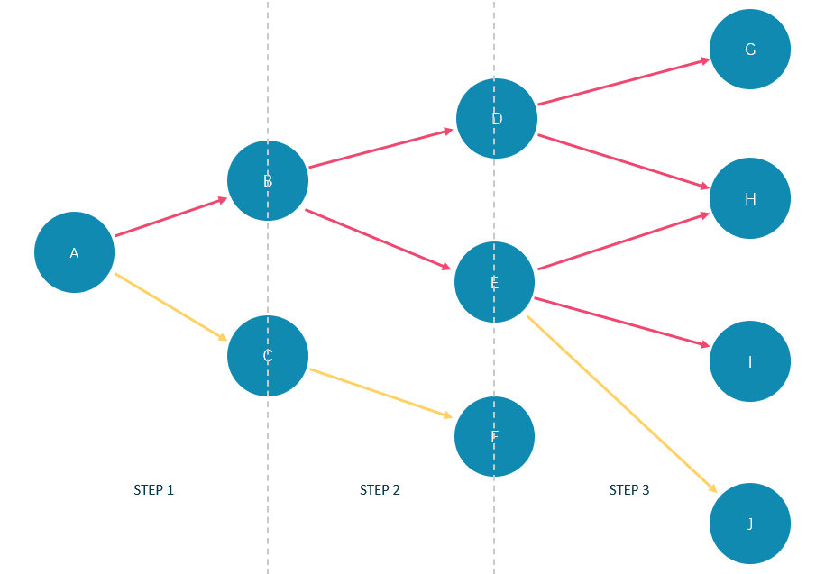

# LIMIT

`LIMIT`子句限制输出结果的行数。`LIMIT`在原生nGQL语句和openCypher兼容语句中的用法有所不同。

- 在原生nGQL语句中，一般需要在`LIMIT`子句前使用管道符，可以直接在LIMIT语句后设置或者省略偏移量参数。

- 在openCypher兼容语句中，不允许在`LIMIT`子句前使用管道符，可以使用`SKIP`指明偏移量。

  !!! Note

        在原生nGQL或openCypher方式中使用`LIMIT`时，使用`ORDER BY`子句限制输出顺序非常重要，否则会输出一个不可预知的子集。

!!! compatibility "历史版本兼容性"

    Nebula Graph 2.6.0中，`GO`语句支持了新的`LIMIT`语法。部分`LIMIT`相关的算子支持计算下推。

## 原生nGQL语句中的LIMIT

在原生nGQL中，`LIMIT`有通用语法和`GO`语句中的专属语法。

### 原生nGQL中的通用LIMIT语法

原生nGQL中的通用`LIMIT`语法与`SQL`中的`LIMIT`原理相同。`LIMIT`子句接收一个或两个参数，参数的值必须是非负整数，且必须用在管道符之后。语法和说明如下：

```ngql
... | LIMIT [<offset>,] <number_rows>;
```

|参数|说明|
|:--|:--|
|`offset`|偏移量，即定义从哪一行开始返回。索引从`0`开始。默认值为`0`，表示从第一行开始返回。|
|`number_rows`|返回的总行数。|

示例：

```ngql
# 从结果中返回最前面的3行数据。
nebula> LOOKUP ON player |\
        LIMIT 3;
+-------------+
| VertexID    |
+-------------+
| "player100" |
| "player101" |
| "player102" |
+-------------+

# 从排序后结果中返回第2行开始的3行数据。
nebula> GO FROM "player100" OVER follow REVERSELY \
        YIELD properties($$).name AS Friend, properties($$).age AS Age \
        | ORDER BY $-.Age, $-.Friend \
        | LIMIT 1, 3;
+-------------------+-----+
| Friend            | Age |
+-------------------+-----+
| "Danny Green"     | 31  |
| "Aron Baynes"     | 32  |
| "Marco Belinelli" | 32  |
+-------------------+-----+
```

### GO语句中的LIMIT

`GO`语句中的`LIMIT`除了支持原生nGQL中的通用语法外，还支持根据边限制输出结果数量。

语法：

```ngql
<go_statement> LIMIT <limit_list>;
```

`limit_list`是一个列表，列表中的元素必须为自然数，且元素数量必须与`GO`语句中的`STEPS`的最大数相同。下文以`GO 1 TO 3 STEPS FROM "A" OVER * LIMIT <limit_list>`为例详细介绍`LIMIT`的这种用法。

* 列表`limit_list`必须包含3个自然数元素，例如`GO 1 TO 3 STEPS FROM "A" OVER * LIMIT [1,2,4]`。
* `LIMIT [1,2,4]`中的`1`表示系统在第一步时自动选择1条边继续遍历，`2`表示在第二步时选择2条边继续遍历，`4`表示在第三步时选择4条边继续遍历。
* 因为`GO 1 TO 3 STEPS`表示返回第一到第三步的所有遍历结果，因此下图中所有红色边和它们的原点与目的点都会被这条`GO`语句匹配上，而黄色边表示`GO`语句遍历时没有选择的路径。如果不是`GO 1 TO 3 STEPS`而是`GO 3 STEPS`，则只会匹配上第三步的红色边和它们两端的点。



在basketballplayer数据集中的执行示例如下：

```ngql
nebula> GO 3 STEPS FROM "player100" \
        OVER * \
        YIELD properties($$).name AS NAME, properties($$).age AS Age \
        LIMIT [3,3,3];
+-----------------+--------------+
| NAME            | Age          |
+-----------------+--------------+
| "Spurs"         | UNKNOWN_PROP |
| "Tony Parker"   | 36           |
| "Manu Ginobili" | 41           |
+-----------------+--------------+

nebula> GO 3 STEPS FROM "player102" \
        OVER * \
        LIMIT [rand32(5),rand32(5),rand32(5)];
+------------+-------------+---------------------+
| serve._dst | follow._dst | any_shape_edge._dst |
+------------+-------------+---------------------+
| "team204"  |             |                     |
| "team215"  |             |                     |
|            | "player100" |                     |
+------------+-------------+---------------------+
```

## openCypher兼容语句中的LIMIT

在`MATCH`等openCypher兼容语句中使用LIMIT不需要加管道符。语法和说明如下：

```ngql
... [SKIP <offset>] [LIMIT <number_rows>];
```

|参数|说明|
|:--|:--|
|`offset`|偏移量，即定义从哪一行开始返回。索引从`0`开始。默认值为`0`，表示从第一行开始返回。|
|`number_rows`|返回的总行数量。|

`offset`和`number_rows`可以使用表达式，但是表达式的结果必须是非负整数。

!!! Note

    两个整数组成的分数表达式会自动向下取整。例如`8/6`向下取整为1。

### 单独使用LIMIT

`LIMIT`可以单独使用，返回指定数量的结果。

```ngql
nebula> MATCH (v:player) RETURN v.name AS Name, v.age AS Age \
        ORDER BY Age LIMIT 5;
+-------------------------+-----+
| Name                    | Age |
+-------------------------+-----+
| "Luka Doncic"           | 20  |
| "Ben Simmons"           | 22  |
| "Kristaps Porzingis"    | 23  |
| "Giannis Antetokounmpo" | 24  |
| "Kyle Anderson"         | 25  |
+-------------------------+-----+

nebula> MATCH (v:player) RETURN v.name AS Name, v.age AS Age \
        ORDER BY Age LIMIT rand32(5);
+-------------------------+-----+
| Name                    | Age |
+-------------------------+-----+
| "Luka Doncic"           | 20  |
| "Ben Simmons"           | 22  |
| "Kristaps Porzingis"    | 23  |
| "Giannis Antetokounmpo" | 24  |
+-------------------------+-----+
```

### 单独使用SKIP

`SKIP`可以单独使用，用于设置偏移量，返回指定位置之后的数据。

```ngql
nebula> MATCH (v:player{name:"Tim Duncan"}) --> (v2) \
        RETURN v2.name AS Name, v2.age AS Age \
        ORDER BY Age DESC SKIP 1;
+-----------------+-----+
| Name            | Age |
+-----------------+-----+
| "Manu Ginobili" | 41  |
| "Tony Parker"   | 36  |
+-----------------+-----+

nebula> MATCH (v:player{name:"Tim Duncan"}) --> (v2) \
        RETURN v2.name AS Name, v2.age AS Age \
        ORDER BY Age DESC SKIP 1+1;
+---------------+-----+
| Name          | Age |
+---------------+-----+
| "Tony Parker" | 36  |
+---------------+-----+
```

### 同时使用SKIP与LIMIT

同时使用`SKIP`与`LIMIT`可以返回从指定位置开始的指定数量的数据。

```ngql
nebula> MATCH (v:player{name:"Tim Duncan"}) --> (v2) \
        RETURN v2.name AS Name, v2.age AS Age \
        ORDER BY Age DESC SKIP 1 LIMIT 1;
+-----------------+-----+
| Name            | Age |
+-----------------+-----+
| "Manu Ginobili" | 41  |
+-----------------+-----+
```

<!--
## 性能提示

Nebula Graph {{ nebula.release }} 未实现 `LIMIT` 语句的存储层下推优化, 类似 `MATCH (n:T) RETURN n LIMIT 10` 语句或者 `LOOKUP on i_T | LIMIT 10` 语句会发生 graphd 资源占用过大的问题：一个 graphd 会从所有的 storaged 获取全部T类型的点，然后返回 10 个。如果全部数据量很大，graphd 此时通常会消耗大量内存，甚至 OOM。
-->
