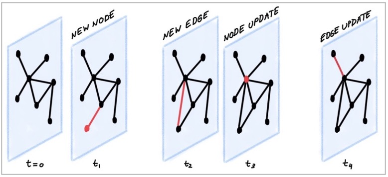

# 图建模设计

本文介绍在Nebula Graph项目中成功应用的一些图建模和系统设计的通用建议。

!!! Note

    本文建议是通用的，在特定领域有例外，请结合实际业务情况进行图建模。

## 以性能为第一目标进行建模

目前 Nebula Graph 没有完美的建模方法，如何建模取决于想从数据中挖掘的内容。分析数据并根据业务模型创建方便直观的数据模型，测试模型并优化，逐渐适应业务。为了更好的性能，用户可以多次更改或重新设计模型。

### 设计和评估最重要的查询语句

在测试环节中，通常会验证各种各样的查询语句，以全面评估系统能力。但在大多数生产场景下，每个集群被频繁调用的查询语句的类型并不会太多；根据20-80原则，针对重要的查询语句进行建模优化。

### Tag 与 Edge type 之间没有绑定关系

任何 Tag 可以与任何 Edge type 相关联，完全交由应用程序控制。不需要在 Nebula Graph 中预先定义，也没有命令获取哪些 Tag 与哪些 Edge type 相关联。

### Tag/Edge type 预先定义了一组属性

建立Tag（或者Edge type）时，需要指定对应的属性。通常称为 Schema。

### 区分“经常改变的部分”和“不经常改变的部分”

改变指的是业务模型和数据模型上的改变（元信息），不是数据自身的改变。

一些图数据库产品是schema-free的设计，所以在数据模型上，不论是图拓扑结构还是属性，都可以非常自由。属性可以建模转变为图拓扑，反之亦然。这类系统通常对于图拓扑的访问有特别的优化。

而 Nebula Graph {{ nebula.release }} 是强 Schema 的（行存型）系统，这意味着业务数据模型中的部分是“不应该经常改变的”，例如属性 Schema 应该避免改变。类似于 MySQL 中 ALTER TABLE 是应该尽量避免的操作。

而点及邻边可以非常低成本的增删，因此可以将业务模型中“经常改变的部分”建模成点或边（关系），而不是属性 Schema。

例如，在一个业务模型中，人的属性是相对固定的，例如“年龄”，“性别”，“姓名”。而“通信好友”，“出入场所”，“交易账号”，“登录设备”等是相对容易改变的。前者适合建模为属性，后者适合建模为点或边。

### 广度优先大于深度优先

- Nebula Graph 基于图拓扑结构进行深度图遍历的性能较低，广度优先遍历以及获取属性的性能较好。例如，模型a包括姓名、年龄、眼睛颜色三种属性，建议创建一个Tag`person`，然后为它添加姓名、年龄、眼睛颜色的属性。如果创建一个包含眼睛颜色的Tag和一个Edge type`has`，然后创建一个边用来表示人拥有的眼睛颜色，这种建模方法会降低遍历性能。

- “通过边属性获取边”的性能与“通过点属性获取点”的性能是接近的。在一些数据库中，会建议将边上的属性重新建模为中间节点的属性：例如 `(src)-[edge {P1, P2}]->(dst)`，`edge` 上有属性 `P1, P2`，会建议建模为 `(src)-[edge1]->(i_node {P1, P2})-[edge2]->(dst)`。在 Nebula Graph {{ nebula.release }} 中可以直接使用 `(src)-[edge {P1, P2}]->(dst)`，减少遍历深度有助于性能。

### 边的方向

查询时，如果需要使用边的逆向查询，可以用如下语法：

`(dst)<-[edge]-(src)` 或者 `GO FROM dst REVERSELY`;

如果不关心边的方向，可以使用如下语法：

`(src)-[edge]-(dst)` 或者 `GO FROM src BIDIRECT`;

因此，通常同一条边没有必要反向再冗余插入一次。

### 合理设置Tag属性

在图建模中，请将一组类似的平级属性放入同一个Tag，即按不同概念进行分组。

### 正确使用索引

使用属性索引可以通过属性查找到 VID。但是索引会导致写性能下降90%甚至更多，只有在根据点或边的属性定位点或边时才使用索引。

### 合理设计VID

参考[点VID一节](../1.introduction/3.vid.md)。

### 长文本

为边创建属性时请勿使用长文本：这些属性会被[存储2份](../1.introduction/3.nebula-graph-architecture/4.storage-service.md)，导致写入放大问题（write amplification）。此时建议将长文本放在 HBase/ES 中，将其地址存放在 Nebula Graph 中。

## 不能支持动态图(时序图)

在某些场景下，图需要同时带有时序信息，以描述整个图的结构随着时间变化的情况[^twitter]。

Nebula Graph {{ nebula.release }} 的边可以使用 Rank 字段存放时间信息(int64)，但是点上没有字段可以存放时间信息（存放在属性会被新写入覆盖）。因此不能支持动态时序图。

[^twitter]: https://blog.twitter.com/engineering/en_us/topics/insights/2021/temporal-graph-networks
