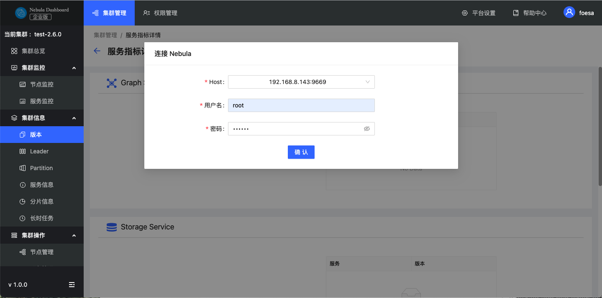
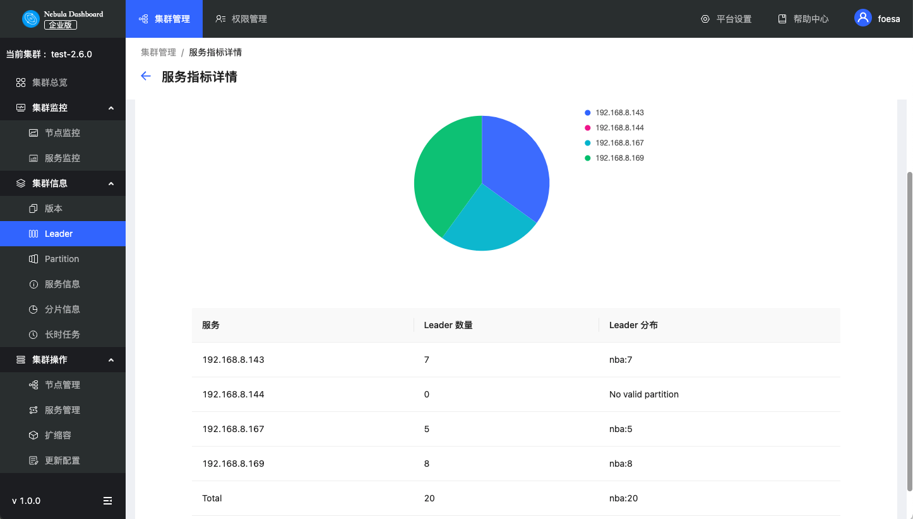
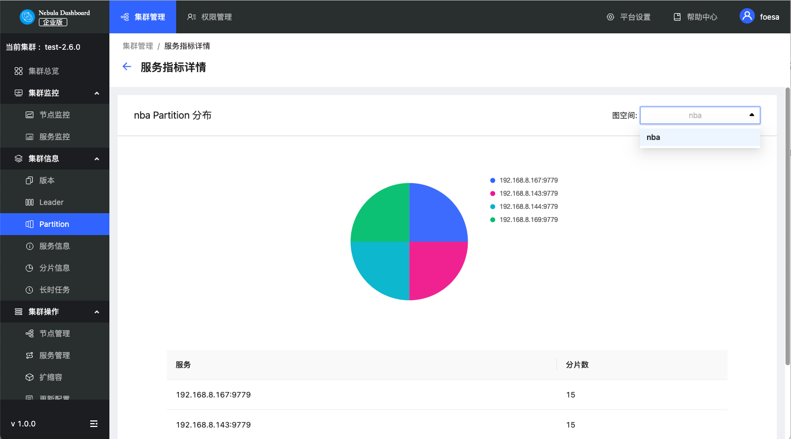
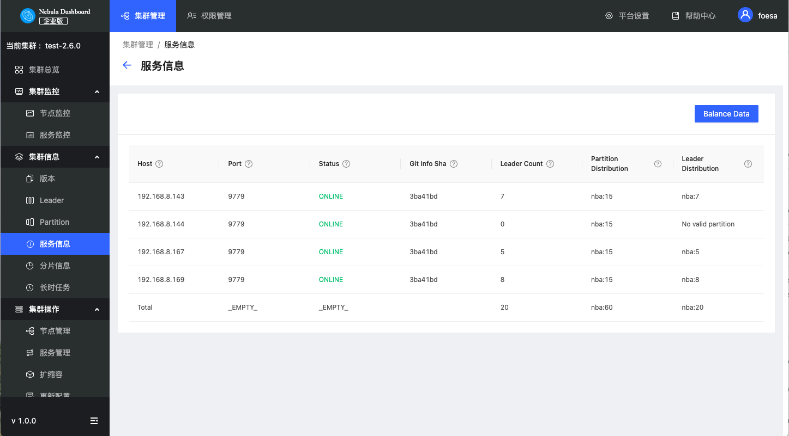
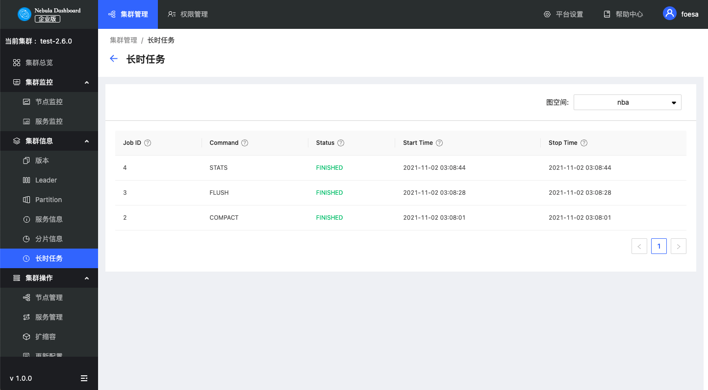

# 集群信息

本文主要介绍 Dashboard 的集群信息，主要为以下六个部分：

- 版本
- Leader
- Partition
- 服务信息
- 分片信息
- 长时任务

在查看集群信息之前，用户需要选择任意一个在线的Graph服务地址，输入登录Nebula Graph的账号（非Dashboard登录账号）和对应密码。

多机部署时，用户可以选择任意一个在线的Graph服务地址。

!!! caution

    用户需要保证Nebula Graph服务已经部署并启动。详细信息，参考[Nebula Graph 安装部署](../../4.deployment-and-installation/1.resource-preparations.md "点击前往 Nebula Graph 安装部署")。

## 版本

显示所有服务及对应的Nebula版本。

## Leader

显示Leader数量及Leader的分布，点击右上角的 **Balance Leader** 按钮可以快速在Nebula Graph集群中均衡分布 Leader。

## Partition

选择指定图空间，查看指定图空间的Partition分布情况。

## 服务信息

展示Storage服务的基本信息。用户可以通过右上角的 **Balance Date** 按钮启动任务，均衡分布集群中的所有分片。参数说明如下：

| 参数 | 说明 |
| :--- | :--- |
| `Host` | 主机地址 |
| `Port` | 主机端口号 |
| `Status` | 主机状态 |
| `Git Info Sha` | 版本Commit ID |
| `Leader Count` | Leader总数 |
| `Partition Distribution` | 分片分布 |
| `Leader Distribution` | Leader分布 |

## 分片信息

显示分片信息。用户需要在左上角选择图空间，查看分片信息。也可以通过右上角的输入框，输入分片ID，筛选展示的数据。参数说明如下：

|参数|说明|
|:---|:---|
|`Partition ID`|分片序号。|
|`Leader`|分片的leader副本的IP地址和端口。|
|`Peers`|分片所有副本的IP地址和端口。|
|`Losts`|分片的故障副本的IP地址和端口。|

## 长时任务

展示所有作业的信息。查看作业信息之前，用户需要在右上角选择图空间。暂不支持在线管理作业，详情请参见[作业管理](../../3.ngql-guide/18.operation-and-maintenance-statements/4.job-statements.md)。参数说明如下：

| 参数 | 说明 |
| :--- | :--- |
| `Job ID` | 显示作业ID。 |
| `Command` | 显示命令类型。 |
| `Status` | 显示作业或任务的状态。状态说明参见 [作业状态](../../3.ngql-guide/18.operation-and-maintenance-statements/4.job-statements.md#_6)。 |
|`Start Time`|显示作业或任务开始执行的时间。|
| `Stop Time` | 显示作业或任务结束执行的时间，结束后的状态包括`FINISHED`、`FAILED`或`STOPPED`。 |