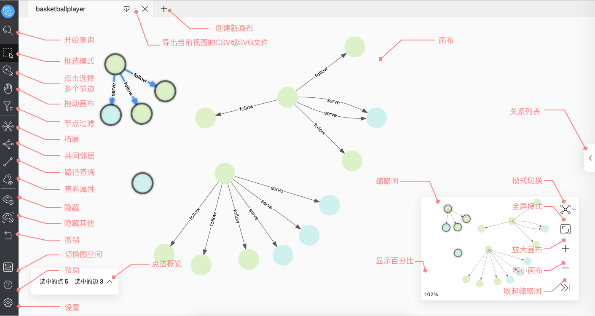

# 什么是 Nebula Explorer

Nebula Explorer （简称 Explorer）是一款可以通过 Web 访问的图探索可视化工具，搭配 Nebula Graph 内核使用，用于与图数据进行可视化交互。即使没有图数据操作经验，用户也可以快速成为图专家。

!!! enterpriseonly

    Explorer 仅在企业版提供。

!!! Note

    用户也可以在 [Explorer](https://explorer.nebula-graph.com.cn/) 在线试用部分功能。

## 适用场景

如果有以下任一需求，都可以使用 Explorer：

- 从复杂关系中快速查找友邻关系、分析可疑目标，需要以可视化的方式展示图数据。

- 针对大规模数据集，需要以可视化的方式对数据进行过滤、分析和图探索。

## 产品优点

- 易于安装：简单步骤即可完成部署。

- 易于使用：使用简洁的可视化交互方式，无需构思 nGQL 语句，轻松实现图探索。

- 灵活性强：支持通过 VID、Tag、Subgraph 等方式查询数据。

- 多种操作：支持对多个点进行拓展操作、查询多个点的共同邻居、查询起点到终点之间的路径等操作。

- 多样展示：支持修改画布中点的颜色和 icon，突出关键节点。也可以在层次图（dagre）、力导向图（force）、环形图（circular）中自由选择数据的展示方式。

<!-- - 便于筛选：支持基于自定义条件灵活筛选需要展示的数据。-->

## 身份验证

Nebula Graph 默认不启用身份验证，一般情况下用户可以使用`root`账号和任意密码登录 Explorer。

Nebula Graph 启用了身份验证后，用户只能使用指定的账号和密码登录 Explorer。

关于 Nebula Graph 的身份验证功能，参考 [Nebula Graph 用户手册](../../7.data-security/1.authentication/1.authentication.md "点击前往 Nebula Graph 官网")。
