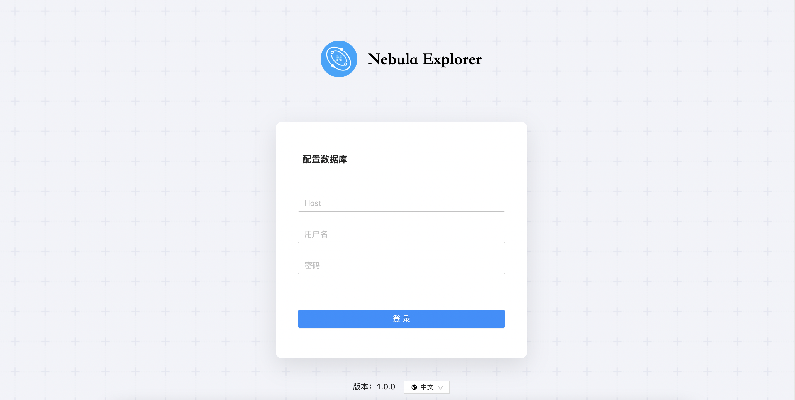

# 部署 Explorer

本文介绍如何在本地通过 RPM 部署 Explorer。

## 前提条件

在部署 Explorer 之前，用户需要确认以下信息：

- Nebula Graph 服务已经部署并启动。详细信息参考[Nebula Graph安装部署](../4.deployment-and-installation/1.resource-preparations.md "点击前往 Nebula Graph 安装部署")。

  !!! Note

        用户可以使用 Docker Compose 或 RPM 方式部署并启动 Nebula Graph 服务。如果刚开始使用 Nebula Graph，建议使用 Docker Compose 部署 Nebula Graph。详细信息参考 [使用 Docker Compose 部署 Nebula Graph](../../2.quick-start/2.deploy-nebula-graph-with-docker-compose.md "点击前往 GitHub 网站")。

- 以下端口未被使用。

  | 端口号 | 说明 |
  | ---- | ---- |
  | 7000 | Explorer 提供的 web 服务 |
  | 8070 | Nebula-http-gateway 的 HTTP 服务 |

## 安装

1. 根据需要下载 RPM 包，建议选择最新版本。常用链接如下：

   | 安装包 | 检验和 | Nebula Graph内核版本 |
   | ----- | ----- | ----- |
   | [nebula-graph-explorer-{{ explorer.base100 }}-1.rpm]() |  [nebula-graph-explorer-{{ explorer.base100 }}-1.rpm.sha256]() | {{ nebula.release }} |

!!! enterpriseonly

    Explorer 仅在企业版提供，点击 [定价](https://nebula-graph.com.cn/pricing/) 查看更多。

2. 使用`sudo rpm -i <rpm>`命令安装RPM包。

   例如，安装 Explorer {{ explorer.base100 }} 版本需要运行以下命令：

   ```bash
   $ sudo rpm -i nebula-graph-explorer-{{ explorer.base100 }}-1.x86_64.rpm
   ```


## 卸载

使用以下的命令卸载 Explorer 。

```bash
$ sudo rpm -e nebula-graph-explorer-{{ explorer.base100 }}-1.x86_64.rpm
```

## 异常处理

如果在安装过程中自动启动失败或是需要手动启动或停止服务，请使用以下命令.

- 手动启动服务
   
   ```bash
   $ sudo sh ./scripts/start.sh
   ```

- 手动停止服务

   ```bash  
   $ sudo sh ./scripts/stop.sh
   ```

## 后续操作

启动成功后，在浏览器地址栏输入 `http://<ip_address>:7000`。

在浏览器窗口中看到以下登录界面表示已经成功部署并启动了 Explorer。



进入 Explorer 登录界面后，用户需要连接 Nebula Graph。详细信息，参考[连接数据库](ex-ug-connect.md)。