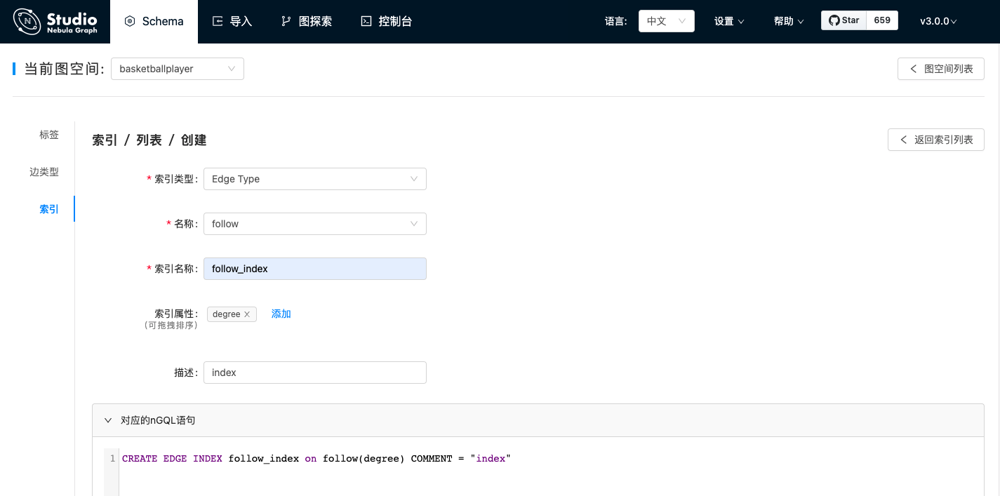

# 操作索引

用户可以为 Tag 和 Edge type 创建索引，使得图查询时可以从拥有共同属性的同一类型的点或边开始遍历，使大型图的查询更为高效。Nebula Graph 支持两种类型的索引：Tag 索引和 Edge type 索引。用户可以选择使用 **控制台** 或者 **Schema** 操作索引。本文仅说明如何使用 **Schema** 操作索引。

!!! Note

    一般在创建了 Tag 或者 Edge type 之后即可创建索引，但是，索引会影响写性能，所以，建议先导入数据，再批量重建索引。关于索引的详细信息，参考 [《nGQL 用户手册》](../../3.ngql-guide/14.native-index-statements/README.md "点击前往 Nebula Graph 网站")。

## 支持版本

Studio v{{ studio.release }} 及以后版本。请更新版本，详细操作参考[版本更新](../about-studio/st-ug-check-updates.md)。

## 前提条件

在 Studio 上操作索引之前，用户必须确认以下信息：

- Studio 已经连接到 Nebula Graph 数据库。
- 图空间、Tag 和 Edge type 已经创建。
- 当前登录的账号拥有 GOD、ADMIN 或者 DBA 的权限。

## 创建索引

按以下步骤使用 **Schema** 创建索引：

1. 在工具栏中，点击 **Schema** 页签。

2. 在 **图空间列表** 中，找到图空间，点击图空间名称或者在 **操作** 列中点击  图标。

3. 在 **当前图空间** 里确认图空间名称。用户也可以通过选择图空间名称切换图空间。

4. 点击 **索引** 页签，再点击 **创建** 按钮。

5. 在 **创建** 页面上，完成以下设置：

  - **索引类型**：确认或修改索引类型，即 **Tag** 或者 **Edge type**。本示例中选择 **Edge type**。
  - **名称**：选择要创建索引的 Tag 或 Edge type 名称。本示例中选择 **follow**。
  - **索引名称**：按规定指定索引名称。本示例中输入 **follow_index**。
  - **索引属性**：点击 **添加**，在 **选择关联的属性** 列表里选择需要索引的属性，并点击 **确定** 按钮。如果需要关联多个属性，重复这一步操作。用户可以按界面提示重排索引属性的顺序。本示例中选择 `degree`。

    !!! Note

        索引属性的顺序会影响 `LOOKUP` 语句的查询结果。详细信息，参考 [《nGQL 用户手册》](../../3.ngql-guide/7.general-query-statements/5.lookup.md "点击前往 Nebula Graph 网站")。

  - **描述**：输入对索引的描述，最大为 256 字节。默认无描述。本示例为 `follow_index`。

6. 完成设置后，在 **对应的 nGQL **面板，用户能看到与上述配置等价的 nGQL 语句。  

7. 确认无误后，点击 **+ 创建** 按钮。
  如果索引创建成功，**定义属性**面板会显示这个索引的属性列表。

## 查看索引

按以下步骤使用 **Schema** 查看索引：

1. 在工具栏中，点击 **Schema** 页签。

2. 在 **图空间列表** 中，找到图空间，点击图空间名称或者在 **操作** 列中点击  图标。

3. 在 **当前图空间** 里确认图空间名称。用户也可以通过选择图空间名称切换图空间。

4. 点击 **索引** 页签，在列表左上方，选择需要查看的索引类型。

5. 在列表中，找到需要查看的索引，点击索引所在行。界面上即列出索引相关的所有属性。

## 删除索引

按以下步骤使用 **Schema** 删除索引：

1. 在工具栏中，点击 **Schema** 页签。

2. 在 **图空间列表** 中，找到图空间，点击图空间名称或者在 **操作** 列中点击  图标。

3. 在 **当前图空间** 里确认图空间名称。用户也可以通过选择图空间名称切换图空间。

4. 点击 **索引** 页签，找到需要修改的索引，并在 **操作** 列中，点击  图标。

5. 在弹出的对话框中点击 **确认**。
